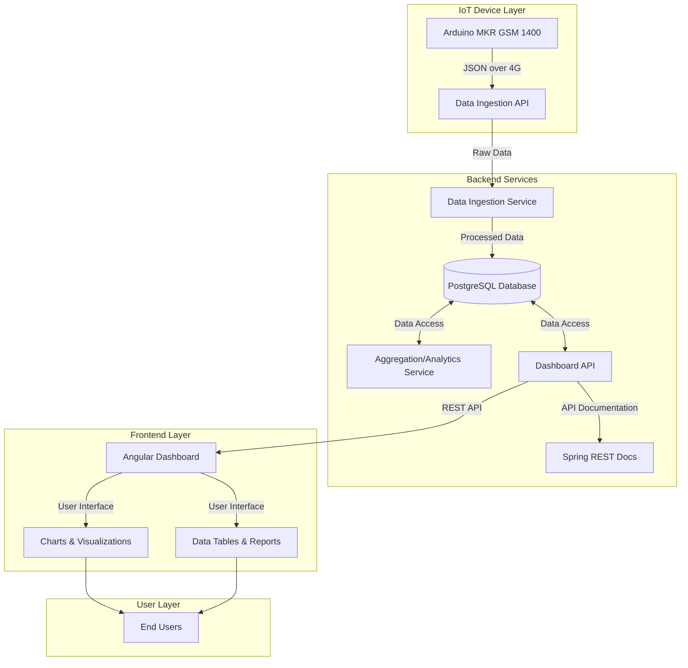

# IoT Energy Monitoring System - Architecture and Project Plan

## 1. System Architecture



### Component Details:

1. **IoT Device Layer**:
   - Arduino MKR GSM 1400 devices collect energy data (temperature, battery voltages, shunt values)
   - Devices send JSON data via 4G to the Data Ingestion API

2. **Backend Services**:
   - **Data Ingestion Service** (Spring Boot, Java):
     - Receives and validates incoming data from IoT devices
     - Processes and normalizes data
     - Stores raw and processed data in PostgreSQL
   
   - **Aggregation/Analytics Service** (Kotlin):
     - Performs data aggregation for different time periods (hourly, daily, monthly)
     - Calculates energy production/consumption trends
     - Generates statistical analysis for reporting
   
   - **Dashboard API** (Spring Boot, Java):
     - Provides REST endpoints for the frontend
     - Handles authentication and authorization
     - Manages user preferences and settings
   
   - **PostgreSQL Database**:
     - Stores device data, user information, and aggregated metrics
     - Maintains historical data with appropriate retention policies

3. **Frontend Layer**:
   - **Angular Dashboard**:
     - Responsive user interface for viewing energy data
     - Interactive charts and visualizations
     - Data tables and downloadable reports
     - User authentication and profile management

## 2. Recommended Project Structure

```
iot-monitor/
│
├── backend/
│   ├── data-ingestion-service/        # Java Spring Boot
│   │   ├── src/main/java/
│   │   │   └── com/company/iotmonitor/ingestion/
│   │   │       ├── config/            # Configuration classes
│   │   │       ├── controller/        # REST controllers
│   │   │       ├── model/             # Data models
│   │   │       ├── repository/        # Database repositories
│   │   │       ├── service/           # Business logic
│   │   │       └── DataIngestionApplication.java
│   │   ├── src/main/resources/        # Application properties, etc.
│   │   └── src/test/                  # Unit and integration tests
│   │
│   ├── analytics-service/             # Kotlin
│   │   ├── src/main/kotlin/
│   │   │   └── com/company/iotmonitor/analytics/
│   │   │       ├── config/            # Configuration classes
│   │   │       ├── controller/        # REST controllers
│   │   │       ├── model/             # Data models
│   │   │       ├── repository/        # Database repositories
│   │   │       ├── service/           # Business logic
│   │   │       └── AnalyticsApplication.kt
│   │   ├── src/main/resources/        # Application properties, etc.
│   │   └── src/test/                  # Unit and integration tests
│   │
│   ├── dashboard-api/                 # Java Spring Boot
│   │   ├── src/main/java/
│   │   │   └── com/company/iotmonitor/api/
│   │   │       ├── config/            # Configuration classes
│   │   │       ├── controller/        # REST controllers
│   │   │       ├── model/             # Data models
│   │   │       ├── repository/        # Database repositories
│   │   │       ├── service/           # Business logic
│   │   │       └── DashboardApiApplication.java
│   │   ├── src/main/resources/        # Application properties, etc.
│   │   └── src/test/                  # Unit and integration tests
│   │
│   ├── common/                        # Shared libraries and utilities
│   │   ├── src/main/java/
│   │   │   └── com/company/iotmonitor/common/
│   │   │       ├── dto/               # Data transfer objects
│   │   │       ├── exception/         # Custom exceptions
│   │   │       └── util/              # Utility classes
│   │   └── src/test/                  # Unit tests
│   │
│   └── docs/                          # API documentation (Spring REST Docs)
│
├── frontend/
│   ├── angular-dashboard/
│   │   ├── src/
│   │   │   ├── app/
│   │   │   │   ├── components/        # Reusable UI components
│   │   │   │   ├── models/            # TypeScript interfaces
│   │   │   │   ├── pages/             # Page components
│   │   │   │   ├── services/          # API services
│   │   │   │   ├── shared/            # Shared utilities
│   │   │   │   └── app.module.ts
│   │   │   ├── assets/                # Static assets
│   │   │   └── environments/          # Environment configurations
│   │   ├── angular.json
│   │   └── package.json
│   │
│   └── docs/                          # Frontend documentation
│
├── database/
│   ├── migrations/                    # Database migration scripts
│   ├── schemas/                       # Database schema definitions
│   └── seed-data/                     # Initial seed data
│
├── docker/
│   ├── docker-compose.yml             # Docker Compose configuration
│   ├── backend/                       # Backend service Dockerfiles
│   └── frontend/                      # Frontend Dockerfile
│
└── docs/                              # Project documentation
    ├── architecture/                  # Architecture diagrams and docs
    ├── api/                           # API specifications
    └── deployment/                    # Deployment guides
```

## 3. Tech Stack Evaluation

### Backend

| Technology | Strengths | Potential Alternatives | Recommendation |
|------------|-----------|------------------------|----------------|
| **Spring Boot (Java)** | Mature ecosystem, excellent documentation, robust, good community support | Quarkus (faster startup, lower memory), Micronaut (cloud-native) | **Keep** - Spring Boot is well-suited for this scale and provides excellent integration with other components |
| **Kotlin (for Analytics)** | Concise syntax, null safety, interoperability with Java | Scala (functional programming), Java (simplicity) | **Keep** - Kotlin offers good benefits while maintaining Java compatibility |
| **Spring REST Docs** | Documentation tied to tests, accurate, clean | Swagger/OpenAPI (more interactive) | **Keep** - Spring REST Docs ensures documentation accuracy |
| **PostgreSQL** | Robust, ACID compliant, good for structured data, JSON support | TimescaleDB (time-series extension for PostgreSQL), InfluxDB (time-series specific) | **Consider TimescaleDB extension** - It's built on PostgreSQL but optimized for time-series data which is perfect for IoT monitoring |

### Frontend

| Technology | Strengths | Potential Alternatives | Recommendation |
|------------|-----------|------------------------|----------------|
| **Angular** | Complete framework, TypeScript, good for enterprise apps | React (more flexible), Vue (simpler learning curve) | **Keep** - Angular works well for dashboards and has good TypeScript support |
| **Angular Material** | Consistent with Angular, comprehensive components | NGX-Bootstrap (lighter) | **Recommend Angular Material** - Provides all core UI components needed for this project |
| **Chart.js/ng2-charts** | Simple API, good performance | Highcharts (more features, commercial), D3.js (highly customizable) | **Recommend NGX-Charts or Highcharts** - Better suited for energy monitoring visualizations |


## 5. UI Libraries and Charting Solutions Recommendations

### UI Libraries for Angular

1. **Angular Material** (Primary Recommendation)
   - Pros: Official Angular library, consistent design language, regular updates
   - Cons: Somewhat opinionated styling, can be heavy
   - Perfect for: Core UI components, navigation, forms, tables

2. **NGX-Bootstrap**
   - Pros: Lightweight, Bootstrap compatibility
   - Cons: Less integrated with Angular ecosystem
   - Consider if: You prefer Bootstrap styling or need lighter components

### Charting Solutions for Energy Monitoring

1. **NGX-Charts** (Primary Recommendation)
   - Pros: Built for Angular, D3-based, responsive
   - Cons: Fewer chart types than commercial alternatives
   - Perfect for: Time-series visualizations, energy consumption/production charts

2. **Highcharts** (Alternative for More Advanced Needs)
   - Pros: Extensive chart types, excellent documentation, interactive features
   - Cons: Commercial license required for commercial use
   - Perfect for: Advanced visualizations, custom chart types

3. **ECharts**
   - Pros: High performance, handles large datasets well
   - Cons: Less Angular-specific documentation
   - Consider if: You need to visualize very large datasets

### Specific Chart Types Recommended for Energy Monitoring

1. **Line Charts**: For tracking energy production/consumption over time
2. **Area Charts**: For showing cumulative energy usage
3. **Bar Charts**: For comparing energy metrics across different time periods

## Summary

This architecture and project plan provides a comprehensive approach to building your IoT energy monitoring system. The design focuses on:

1. A clean separation of concerns with distinct services for data ingestion, analytics, and dashboard API
2. Efficient data storage with PostgreSQL (recommended with TimescaleDB extension for time-series optimization)
3. A scalable frontend using Angular with recommended UI libraries and charting solutions
4. A phased implementation approach with a realistic timeline

The system will effectively handle your requirements for monitoring 10-50 devices with data collected every few minutes, with a focus on historical data analysis and energy production/consumption trends.
