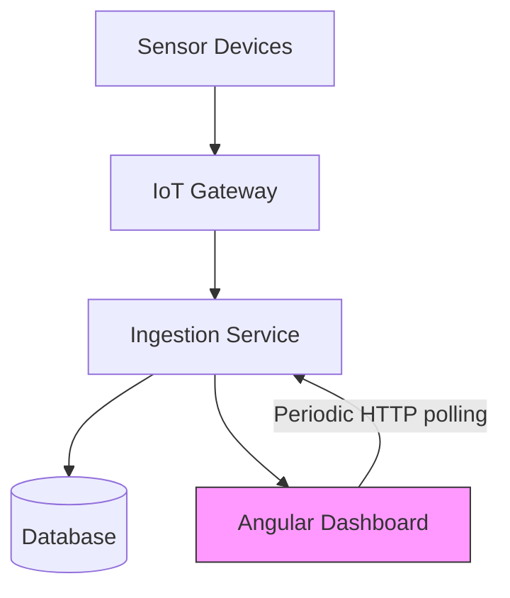
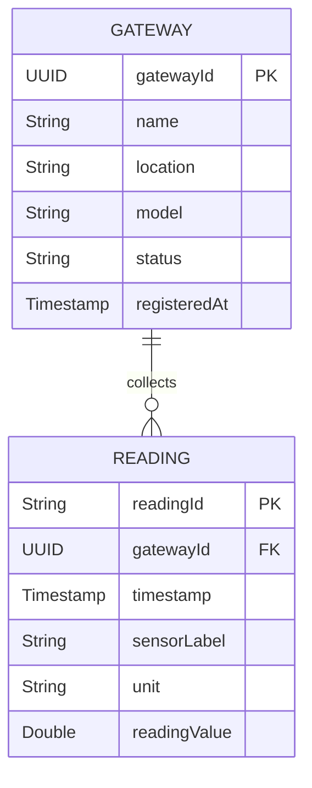
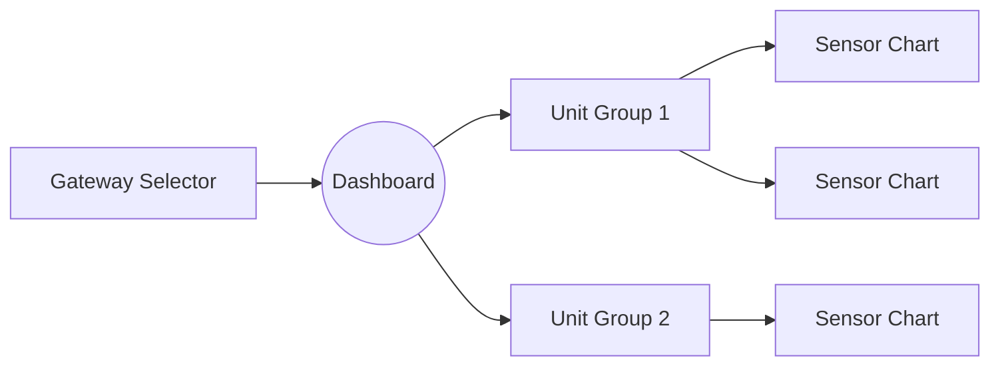

# IoT Gateway and Sensor Data Monitoring System - Architecture Documentation

**Project Purpose:**  
The system monitors IoT gateways that collect sensor data (temperature, humidity, battery voltage) from connected devices. The gateway-focused architecture simplifies device management while maintaining robust data collection capabilities.

**Key Features:**  
* **Gateway Management:**  
    * Simplified gateway registration (name, location, model)  
    * Gateway authentication and authorization  
    * Gateway deletion with cascade to readings
* **Data Ingestion:**  
    * Receives sensor data from registered gateways  
* **Data Storage:**  
    * Stores gateway metadata and sensor readings  
    * Historical data retention  

**Architecture Components:**  
* **IoT Gateways:** Hardware units that collect and transmit sensor data  
* **Ingestion Service:** REST API for gateway registration and data submission  
* **Database:** Stores gateway metadata and sensor readings  
* **Angular Dashboard:** Web interface for monitoring and management  



**Technology Stack:**  
* **Backend:** Spring Boot (Java)  
* **Database:** PostgreSQL  
* **Frontend:** Angular + Apache ECharts  
* **API Documentation:** OpenAPI/Swagger  

## Domain Model

The system is built around two primary entities:

### Gateway
Represents a physical IoT gateway device that collects and forwards sensor data.

**Properties:**
- `gatewayId` (UUID): Unique identifier
- `name` (String): Human-readable name
- `location` (String): Physical location description
- `model` (String): Hardware model identifier
- `status` (String): Current operational status (e.g., "ACTIVE")
- `registeredAt` (Timestamp): When the gateway was first registered

### Reading
Represents a single sensor reading collected by a gateway.

**Properties:**
- `readingId` (String): Unique identifier
- `gateway` (Gateway): Reference to the parent gateway
- `timestamp` (Timestamp): When the reading was taken
- `sensorLabel` (String): Identifier of the sensor that provided the reading
- `unit` (String): Measurement unit (e.g., "celsius", "percent", "volt")
- `readingValue` (Double): The actual measurement value

### Relationships



This simplified model focuses on gateways and their readings, eliminating the need to track individual sensor devices. The `sensorLabel` field in the Reading entity preserves the sensor identifier that comes from the gateway, allowing for grouping and visualization of readings by sensor while maintaining a clean, two-entity architecture.

## API Endpoint Design

### Gateway Endpoints

1. List Gateways:
- **GET** `/gateways`
- **Response**:
  ```json
  [
    {
      "gatewayId": "a6b3c2d1-e8f3-4a7c-b229-1f2e5b9c8d47",
      "name": "Gateway 1A",
      "location": "Building 3 - Server Room",
      "model": "IoT-GW-2025",
      "status": "ACTIVE",
      "registeredAt": "2025-04-08T09:15:00Z"
    }
  ]
  ```

2. Register Gateway:
- **POST** `/gateways`
- **Request**:
  ```json
  {
    "name": "Gateway 1A",
    "location": "Building 3 - Server Room",
    "model": "IoT-GW-2025"
  }
  ```

3. Get Gateway Details:
- **GET** `/gateways/{gatewayId}`
- **Response**:
  ```json
  {
    "gatewayId": "a6b3c2d1-e8f3-4a7c-b229-1f2e5b9c8d47",
    "name": "Gateway 1A",
    "location": "Building 3 - Server Room",
    "model": "IoT-GW-2025",
    "status": "ACTIVE",
    "registeredAt": "2025-04-08T09:15:00Z"
  }
  ```

4. Update Gateway:
- **PATCH** `/gateways/{gatewayId}`
- **Request**:
  ```json
  {
    "name": "Gateway 1A Updated",
    "location": "Building 3 - Floor 2",
    "model": "IoT-GW-3000"
  }
  ```

5. Delete Gateway:
- **DELETE** `/gateways/{gatewayId}`
- **Response**: 204 No Content

### Reading Endpoints

1. Single Reading:
- **POST** `/readings`
- **Request**:
  ```json
  {
    "gatewayId": "a6b3c2d1-e8f3-4a7c-b229-1f2e5b9c8d47",
    "data": {
      "sensor": "battery-1",
      "unit": "volt",
      "reading": 51.5,
      "timestamp": "2025-04-07T12:00:00Z"
    }
  }
  ```

2. Batch Readings:
- **POST** `/readings/batch` 
- **Request**:
  ```json
  {
    "gatewayId": "a6b3c2d1-e8f3-4a7c-b229-1f2e5b9c8d47",
    "data": [
      {
        "sensor": "temp-1",
        "unit": "celsius",
        "reading": 24.3,
        "timestamp": "2025-04-07T12:00:00Z"
      },
      {
        "sensor": "humidity-1",
        "unit": "percent",
        "reading": 48.5,
        "timestamp": "2025-04-07T12:00:01Z"
      }
    ]
  }
  ```

3. Get Readings:
- **GET** `/readings/{gatewayId}?start=2025-04-01T00:00:00Z&end=2025-04-08T00:00:00Z`
- **Response**:
  ```json
  [
    {
      "readingId": "b8c9d0e1-f2a3-4b5c-6d7e-8f9a0b1c2d3e",
      "timestamp": "2025-04-07T12:00:00Z",
      "sensorLabel": "temp-1",
      "unit": "celsius",
      "readingValue": 24.3
    },
    {
      "readingId": "c9d0e1f2-a3b4-5c6d-7e8f-9a0b1c2d3e4f",
      "timestamp": "2025-04-07T12:00:01Z",
      "sensorLabel": "humidity-1",
      "unit": "percent",
      "readingValue": 48.5
    }
  ]
  ```


## Validation Rules
- Gateway Name: Non-unique, updates existing records
- Location: Free-form string
- Timestamp: Valid ISO-8601 format
- Sensor Values: Accept any numeric value

_Note: All data validation removed per product decisions on 08/04/2025_

## Response Formats

### Dashboard Reading Data Format
- **Example Response**:
```json
{
  "gatewayId": "a6b3c2d1-e8f3-4a7c-b229-1f2e5b9c8d47",
  "timeRange": {
    "start": "2025-04-01T00:00:00Z",
    "end": "2025-04-08T00:00:00Z"
  },
  "unitGroups": [
    {
      "unit": "volt",
      "sensors": [
        {
          "id": "battery-1",
          "name": "battery-1",
          "readings": [
            {"timestamp": "2025-04-07T12:00:00Z", "value": 51.5},
            {"timestamp": "2025-04-07T12:15:00Z", "value": 50.9}
          ]
        }
      ]
    },
    {
      "unit": "celsius",
      "sensors": [
        {
          "id": "temp-1",
          "name": "temp-1",
          "readings": [
            {"timestamp": "2025-04-07T12:00:00Z", "value": 24.3},
            {"timestamp": "2025-04-07T12:15:00Z", "value": 24.1}
          ]
        }
      ]
    }
  ]
}
```

### Reading Submission Response
```json
{
  "status": "ACCEPTED"
}
```

## Frontend-Backend Integration
[Remaining existing content...]
## Frontend Views & Features

### Gateway Selection View
- Dropdown list of all registered gateways
- Auto-selects first gateway on initial load
- Shows last activity timestamp
- Refresh button for manual updates

### Sensor Dashboard View


**Key Features:**
1. Dynamic Chart Grid
   - Responsive layout using CSS Grid
   - Charts auto-resize based on container
   - Grouped by measurement unit (voltage, temperature, etc)
   - Each unit group has collapsible section

2. Chart Specifications
   - Line charts showing 7-day history
   - Hover tooltips with exact values
   - Axis labels with localized timezone
   - Color-coded by sensor type

3. Auto-Refresh Mechanism
   - 15-minute polling interval
   - Visual loading indicators
   - Error handling for disconnected gateways

4. Responsive Design
   - Mobile-first approach
   - Adaptive column count (1-3 columns)
   - Touch-friendly chart controls

**Data Flow:**
1. Fetch gateway list on initial load
2. Auto-select first gateway
3. Retrieve last 7 days of readings
4. Group readings by unit
5. Render charts in unit groups

**Component Structure:**
- GatewaySelectorComponent (Top bar dropdown)
- UnitGroupComponent (Collapsible section per unit)
- SensorChartComponent (Individual ECharts instance)
- DashboardService (State management)
**Service Contracts:**  
[Remaining existing content...]  
**Recent Changes:**  
[Remaining existing content...]  
**Current Status:**  
[Remaining existing content...]
